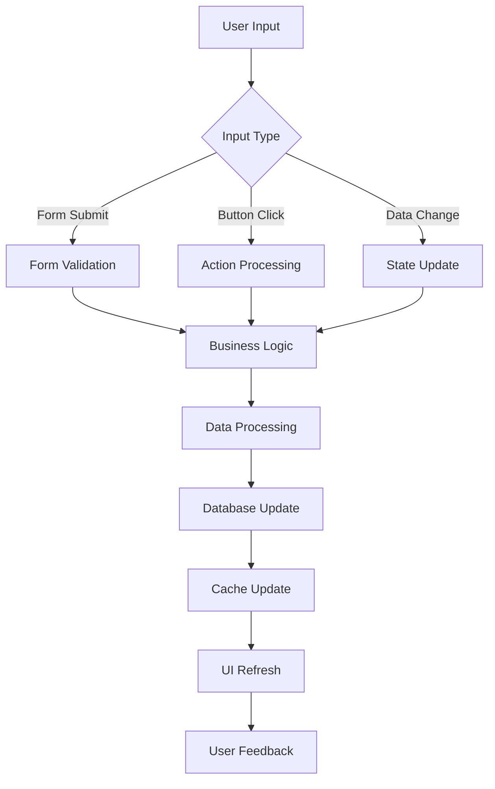
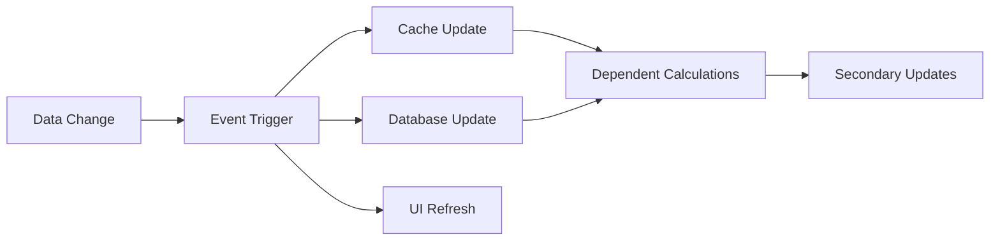

# Luồng Dữ Liệu Hệ Thống

## Tổng Quan Luồng Dữ Liệu

Hệ thống sử dụng **Unidirectional Data Flow** với **Event-Driven Architecture** để đảm bảo consistency và traceability.

```
┌─────────────┐    ┌─────────────┐    ┌─────────────┐    ┌─────────────┐
│    User     │───▶│  Streamlit  │───▶│  Business   │───▶│  Database   │
│ Interface   │    │     UI      │    │   Logic     │    │             │
└─────────────┘    └─────────────┘    └─────────────┘    └─────────────┘
       ▲                   ▲                   ▲                   │
       │                   │                   │                   │
       │            ┌─────────────┐    ┌─────────────┐             │
       │            │   Cache     │    │ Validation  │             │
       │            │   Layer     │    │   Layer     │             │
       │            └─────────────┘    └─────────────┘             │
       │                   ▲                   ▲                   │
       │                   │                   │                   ▼
       └───────────────────┴───────────────────┴───────────────────┘
                              Response Flow
```

## 1. User Interaction Flow

### A. User Input Processing



### B. Specific User Actions

#### Thêm Nhà Đầu Tư
```
1. User điền form → 2. Client Validation → 3. Submit to Backend
4. Server Validation → 5. Business Logic → 6. Database Insert
7. Cache Update → 8. UI Refresh → 9. Success Message
```

#### Thêm Giao Dịch  
```
1. User chọn NĐT + Amount → 2. Validate Input → 3. Calculate Units
4. Update Tranches → 5. Create Transaction → 6. Update NAV
7. Save to Database → 8. Refresh UI → 9. Show Results
```

#### Tính Phí
```
1. User nhập parameters → 2. Calculate Preview → 3. Show Details
4. User Confirmation → 5. Apply Fees → 6. Update HWMs
7. Transfer Units → 8. Save Records → 9. Update Reports
```

## 2. Data Processing Flow

### A. Transaction Processing Pipeline

```
Input Validation → Business Rule Check → Tranche Management → Database Transaction → Cache Update → UI Refresh
```

#### Chi Tiết Processing Steps:

1. **Input Validation**
   ```python
   def validate_transaction_input(investor_id, amount, nav):
       # Validate investor exists
       # Validate amount > 0
       # Validate NAV > 0
       # Return validation result
   ```

2. **Business Rule Check**
   ```python
   def check_business_rules(transaction_data):
       # Check minimum investment
       # Check fund availability 
       # Check investor status
       # Return rule compliance
   ```

3. **Tranche Management**
   ```python
   def manage_tranches(investor_id, amount, nav, transaction_type):
       if transaction_type == "deposit":
           # Create new tranche
       elif transaction_type == "withdrawal":
           # Split/close tranches
       # Update units and values
   ```

4. **Database Transaction**
   ```python
   def execute_transaction(transaction_data):
       with database.transaction():
           # Insert transaction record
           # Update tranche records  
           # Update investor balances
           # Commit or rollback
   ```

### B. Fee Calculation Flow

```
Fee Request → Performance Analysis → HWM Check → Fee Calculation → Preview → Confirmation → Application
```

#### Detailed Fee Processing:

1. **Performance Analysis**
   ```python
   def analyze_performance(tranches, current_nav):
       for tranche in tranches:
           current_value = tranche.units * current_nav
           performance = (current_value / tranche.original_invested_value) - 1
           yield (tranche, performance)
   ```

2. **High Water Mark Check**
   ```python
   def check_hwm(tranche, current_nav):
       current_performance = current_nav / tranche.entry_nav
       if current_performance > tranche.hwm:
           excess_performance = current_performance - tranche.hwm
           return excess_performance
       return 0
   ```

3. **Fee Calculation**
   ```python
   def calculate_fees(excess_performance, invested_value, fee_rate):
       fee_amount = excess_performance * invested_value * fee_rate
       units_to_transfer = fee_amount / current_nav
       return fee_amount, units_to_transfer
   ```

## 3. Data Storage Flow

### A. Layered Storage Architecture

```
┌─────────────────────────────────────┐
│           Application Layer          │
│ ┌─────────────┐ ┌─────────────────┐ │
│ │   Cache     │ │  Session Data   │ │
│ │   Layer     │ │    (Temp)       │ │
│ └─────────────┘ └─────────────────┘ │
└─────────────────────────────────────┘
                    │
┌─────────────────────────────────────┐
│          Business Layer             │
│ ┌─────────────┐ ┌─────────────────┐ │
│ │   Domain    │ │   Service       │ │
│ │   Objects   │ │   Layer         │ │
│ └─────────────┘ └─────────────────┘ │
└─────────────────────────────────────┘
                    │
┌─────────────────────────────────────┐
│           Data Layer                │
│ ┌─────────────┐ ┌─────────────────┐ │
│ │ Data Handler│ │ Connection Pool │ │
│ │             │ │                 │ │
│ └─────────────┘ └─────────────────┘ │
└─────────────────────────────────────┘
                    │
┌─────────────────────────────────────┐
│          Storage Layer              │
│ ┌─────────────┐ ┌─────────────────┐ │
│ │ PostgreSQL  │ │  File System    │ │
│ │ (Supabase)  │ │   (Backup)      │ │
│ └─────────────┘ └─────────────────┘ │
└─────────────────────────────────────┘
```

### B. Read vs Write Patterns

#### Read Pattern (Query Flow)
```
UI Request → Cache Check → Cache Miss? → Database Query → Object Mapping → Cache Store → Return Data
```

#### Write Pattern (Update Flow)
```
Business Logic → Validation → Database Transaction → Cache Invalidation → Success Response
```

### C. Consistency Guarantees

1. **Database Level**
   - ACID transactions
   - Foreign key constraints  
   - Data type validation

2. **Application Level**
   - Business rule validation
   - Cross-table consistency checks
   - Audit trail maintenance

3. **Cache Level**
   - Cache invalidation on writes
   - TTL-based expiration
   - Consistency checks

## 4. External Service Integration Flow

### A. Google Drive Integration

```
Export Request → Generate Report → Upload to Drive → Return Public Link → Update UI
```

#### Detailed Integration Steps:

1. **Report Generation**
   ```python
   def generate_excel_report(data):
       # Create Excel workbook
       # Format data sheets
       # Apply styling  
       # Save temporary file
       return file_path
   ```

2. **Drive Upload**
   ```python
   def upload_to_drive(file_path, folder_id):
       # Authenticate with service account
       # Upload file to specified folder
       # Set file permissions
       # Return file metadata
   ```

3. **Link Generation**
   ```python
   def generate_public_link(file_id):
       # Make file publicly readable
       # Generate shareable link
       # Return link URL
   ```

### B. Backup Flow

```
Scheduled Trigger → Data Export → File Compression → Remote Storage → Cleanup → Notification
```

## 5. Real-time Data Synchronization

### A. Event-Driven Updates



### B. Conflict Resolution

```python
def resolve_data_conflicts(local_data, server_data):
    """
    Conflict resolution strategy:
    1. Server data wins for critical fields
    2. Merge non-conflicting changes
    3. Flag conflicts for manual review
    """
    if server_data.last_modified > local_data.last_modified:
        return server_data  # Server wins
    else:
        return merge_changes(local_data, server_data)
```

## 6. Error Handling và Recovery Flow

### A. Error Propagation

```
Error Source → Error Handler → Logging → User Notification → Recovery Action
```

#### Error Categories:

1. **Validation Errors**
   - Input validation failures
   - Business rule violations
   - Data integrity issues

2. **System Errors**
   - Database connection failures
   - External service timeouts
   - Memory/performance issues

3. **Business Errors**
   - Insufficient funds
   - Calculation errors
   - Logic inconsistencies

### B. Recovery Strategies

```python
def handle_database_error(error, operation_data):
    """
    Recovery flow:
    1. Log error details
    2. Attempt retry with backoff
    3. Fall back to cache/file storage
    4. Notify user of degraded mode
    5. Queue operation for retry
    """
    log_error(error, operation_data)
    
    for attempt in range(MAX_RETRIES):
        try:
            return retry_operation(operation_data)
        except:
            wait_exponential_backoff(attempt)
    
    # Fallback mode
    return fallback_to_csv_storage(operation_data)
```

## 7. Performance Optimization Flow

### A. Caching Strategy

```
Request → Cache Lookup → Cache Hit? → Return Cached → Update TTL
       → Cache Miss → Database Query → Cache Store → Return Data
```

#### Multi-level Caching:

1. **Memory Cache** (Streamlit @st.cache_resource)
   - Configuration objects
   - Data handler instances  
   - Heavy computation results

2. **Data Cache** (Streamlit @st.cache_data)
   - Query results with TTL
   - Calculated statistics
   - Report data

3. **File Cache**
   - Generated reports
   - Export files
   - Backup data

### B. Query Optimization

```python
def optimize_database_queries():
    """
    Optimization strategies:
    1. Use batch operations
    2. Implement pagination
    3. Add database indexes
    4. Use connection pooling
    """
    
    # Batch operations
    def batch_insert(records):
        with database.transaction():
            database.bulk_insert(records)
    
    # Pagination
    def get_transactions_paginated(page, size):
        return database.query(
            "SELECT * FROM transactions LIMIT ? OFFSET ?",
            (size, page * size)
        )
```

## 8. Data Security Flow

### A. Authentication Flow

```
Login Request → Password Validation → Session Creation → Permission Check → Access Grant
```

### B. Data Access Control

```python
def check_data_access_permissions(user, action, resource):
    """
    Permission matrix:
    - Viewer: Read-only access
    - Admin: Full CRUD access
    - Fund Manager: Special withdrawal permissions
    """
    
    if user.role == "viewer":
        return action in ["read", "view", "export"]
    elif user.role == "admin":
        return True  # Full access
    elif user.role == "fund_manager":
        return action in ["read", "view", "withdraw", "export"]
    
    return False
```

### C. Audit Trail Flow

```
User Action → Action Logging → Database Insert → Audit Report → Compliance Check
```

## 9. Mobile và Responsive Flow

### A. Device Detection

```python
def detect_device_type():
    """
    Responsive design flow:
    1. Detect screen size
    2. Apply appropriate CSS
    3. Adjust component layout
    4. Optimize interactions
    """
    
    if screen_width < 768:
        return "mobile"
    elif screen_width < 1024:
        return "tablet" 
    else:
        return "desktop"
```

### B. Progressive Loading

```
Initial Load → Critical CSS → Above-fold Content → Below-fold Content → Interactive Features
```

## 10. Monitoring và Debugging Flow

### A. Health Check Flow

```
Periodic Check → Database Ping → Service Status → Performance Metrics → Alert Threshold → Notification
```

### B. Debug Information Flow

```python
def collect_debug_info():
    """
    Debug data collection:
    1. System state snapshot
    2. Recent error logs
    3. Performance metrics
    4. Database statistics
    5. Cache hit rates
    """
    
    return {
        "system_state": get_system_state(),
        "recent_errors": get_recent_errors(),
        "performance": get_performance_metrics(),
        "database": get_db_statistics(),
        "cache": get_cache_statistics()
    }
```